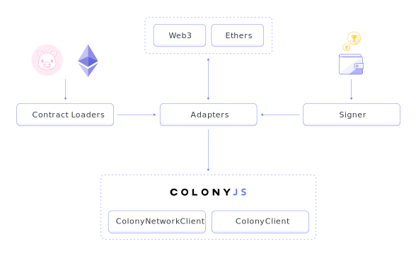

colonyJS is a library to help developers build with Colony. Using the colonyJS library, you can build applications that query and interact with the Colony Network smart contracts through a simple and standard JavaScript interface.

colonyJS itself is split into a few components to allow for flexibility in development:

* [Loaders](/colonyjs/docs-loaders) provide a simple way to get the address and ABI of a deployed contract, in a certain version, at a particular location. For example, loaders can pull contract data from deployed contracts using Etherscan or from locally deployed contracts using Colony's very own TrufflePig.

* [Adapters](/colonyjs/docs-adapters) represent the colonyJS solution for the many different ways to access the Ethereum blockchain provided by various JavaScript libraries. Adapters provide a wrapper for such libraries that enforces a standard and predictable API for use with the Colony Network smart contracts.

* [Contract Clients](/colonyjs/docs-clients) are aggregations of all the interactions possible with the Colony Network smart contracts, packaging methods into clients that can be used in your JavaScript application to easily interact with the Colony Network. Currently there are four clients: `ColonyNetworkClient`, `ColonyClient`, `MetaColonyClient` and `TokenClient`.

## Jump in

colonyJS is under active development and new features are constantly being added. If you notice a discrepancy in the documentation on this site or a bug in the code, please help us out by [creating an issue](https://github.com/JoinColony/colonyJS/issues)!

That being said, everything you need to create your first colony can be found in [Get Started](/colonyjs/docs-get-started/). For more examples, check out the `colony-starter-basic` package in [colonyStarter](/colonystarter/docs-overview), which demonstrates how to create a colony, add a domain, add a global skill, and run through the complete task lifecycle.
