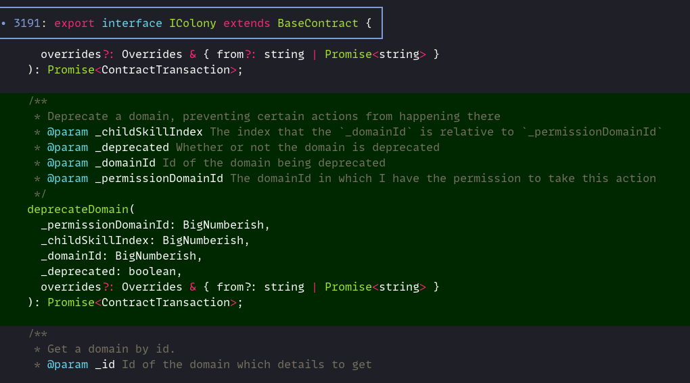

# Upgrading the ColonyNetwork version

When the ColonyNetwork contracts are updated to new versions, ColonyJS _will_ need to be adjusted to support these versions. ColonyJS tries to make the interactions with the ColonyNetwork as easy as possible by introducing certain helper functions and by providing all the typings for the different contracts and their individual versions. Follow this guide to undertake the necessary steps to make ColonyJS support the new contract versions.

## Generating the contract ABIs

First we need to create the relevant contract ABIs and store them in the ColonyJS repo (these are just `.json` files containing information about the contract interfaces. We will be generating them in the `colonyNetwork` repo which is a submodule of ColonyjS.&#x20;

Make sure you have the correct node version

```bash
nvm use
```

Go into the `vendor/colonyNetwork` subdirectory and check out the correct tag for the latest ColonyNetwork version (here `glwss`):

```bash
cd vendor/colonyNetwork
git checkout glwss
```

Update all git submodules and install all dependencies (see also [this guide](https://colony.gitbook.io/colony-network/quick-start)):

```bash
git submodule update --recursive
npm ci
```

Prepare the token submodule (and delete any existing build artifacts):

```bash
cd lib/colonyToken
npm ci # again, make sure you're running the correct node version (with nvm)
rm -rf build/contracts/*.json # to remove any prior builds
git reset --hard # to recover the pinned (checked in) contracts
npx truffle compile
```

You will need Docker installed and running to compile the contracts. It is however possible to disable Docker for the builds, see [here](https://colony.gitbook.io/colony-network/quick-start) for more information.

Then back in the `vendor/colonyNetwork` submodule:

```bash
rm -rf build/contracts/*.json # to remove any prior builds
npx truffle compile
```

Now we should have all the necessary contract ABIs ready. Next we extract those using a helper script within ColonyJS. Execute the following script. For the tag name use the tag checked out in the `colonyNetwork` directory (here `glwss`):

```bash
cd ../.. # go back to the colonyJS root folder
npm run extract-contract-abis -- -t=glwss
```

That process should be  fairly quick. A directory called `src/abis/glwss` should have been created, containing all the required ABIs for the next version (and more).

## Building the TypeChain typings

For ColonyJS, we use [TypeChain](https://github.com/dethcrypto/TypeChain) to create the TypeScript typings for the individual contracts. To make the process easier we provide helper scripts that do most of the heavy lifting.&#x20;

First we need to find out all the latest versions of the contracts that were updated. Go to the [colonyNetwork repository](https://github.com/JoinColony/colonyNetwork) in GitHub, select latest release tag (e.g. `glwss`). Go to `contracts`, look at `colony/Colony.sol`, and all the `extensions`

In `scripts/build-contracts.ts` adjust in `RELEASE_MAP`. If the colony version you see is newer, add the tag and adjust `latest` to the next version ( add 1). Do this with all the extension contracts as well (and add contracts if any were added in the new release). If a contract wasn't updated (no new version) you don't need to do anything for that one there.

Now the fun part begins! Build the contract type definitions using TypeChain by doing (replace `glwss` with the ColonyNetwork version tag you're adding):

```bash
npm run build-contracts -- -t=glwss
```

&#x20;The type definitions will be placed in the `src/contracts` folder. You will see subfolders being created for all contracts and their versions. Next, we will integrate the new types.

## Adding new clients to the exports

The most important files are the files named `exports.ts`. They are laid out in a way so that only they have to be changed on a version update (with a few exceptions). Look for files named `exports.ts` in the `src/contracts` and in the `src/clients` directories. Amend the files following the established patterns.

One notable exception are the individual augments files (basically all the files in the `augments` folders that are not `commonAugments`). There you need to adjust the `ValidXXX` types to add the newest version of the Colony or extensions.

Now we create ContractClients for all the versioned contracts. They are usually called `XXXClientVX.ts` and reside in the `src/clients/(Core|Extensions)` directories. Also here just follow the patterns already established in previous versions. This is how a bare minimum `ColonyClient` might look like:

```typescript
import { IColony__factory as IColonyFactory } from '../../contracts/IColony/9/factories/IColony__factory';
import { IColony } from '../../contracts/IColony/9/IColony';
import { ColonyNetworkClient } from '../ColonyNetworkClient';
import { AugmentedIColony, AugmentedEstimate } from './augments/commonAugments';
import { ColonyAugmentsV3 } from './augments/augmentsV3';
import { ColonyAugmentsV4 } from './augments/augmentsV4';
import {
  addAugments,
  ColonyAugmentsV5,
  AugmentedEstimateV5,
} from './augments/augmentsV5';
import {
  AddDomainAugmentsB,
  AddDomainEstimateGasB,
  addAugmentsB as addAddDomainAugments,
} from './augments/AddDomain';
import {
  MoveFundsBetweenPotsAugmentsB,
  MoveFundsBetweenPotsEstimateGasB,
  addAugmentsB as addMoveFundsBetweenPotsAugments,
} from './augments/MoveFundsBetweenPots';
import { SignerOrProvider } from '../../types';

interface ColonyClientV9Estimate
  extends AugmentedEstimate<IColony>,
    AugmentedEstimateV5,
    AddDomainEstimateGasB,
    MoveFundsBetweenPotsEstimateGasB {}

export interface ColonyClientV9
  extends AugmentedIColony<IColony>,
    ColonyAugmentsV3<IColony>,
    ColonyAugmentsV4<IColony>,
    ColonyAugmentsV5<IColony>,
    AddDomainAugmentsB<IColony>,
    MoveFundsBetweenPotsAugmentsB<IColony> {
  clientVersion: 9;
  estimateGas: ColonyClientV9Estimate;
}

export default function getColonyClient(
  this: ColonyNetworkClient,
  address: string,
  signerOrProvider: SignerOrProvider,
): ColonyClientV9 {
  const colonyClient = IColonyFactory.connect(
    address,
    signerOrProvider,
  ) as ColonyClientV9;

  colonyClient.clientVersion = 9;
  addAugments(colonyClient, this);
  addAddDomainAugments(colonyClient);
  addMoveFundsBetweenPotsAugments(colonyClient);

  return colonyClient as ColonyClientV9;
}

```

We are adding the common augments and also individual augments that were deprecated in previous versions (`AddDomainAugments` and `MoveFundsBetweenPotsAugments`). If these are still supported in your version, you will need to add them, too. Do this for all versioned contracts (Core and Extensions).

## Adding permission proof helpers

Next step is to look for contract methods that require permission proofs. If there are any, this will require us to create new augments. For that we look at the generated type definitions as they are much easier to read. We should be looking at a diff between the generated TypeChain files of the previous version (of for example `IColony.ts`) and the latest version. A good tool to do that with would be [`delta`](https://github.com/dandavison/delta).

```bash
delta src/contracts/IColony/8/IColony.ts src/contracts/IColony/9/IColony.s
```

Look for methods that have a `_permissionDomainId` and a `_childSkillIndex`. These need permission proof helpers (the functions called `...WithProofs`. Let's take an example here. In `lwss` the `deprecateDomain` function was added and as we can see it needs the `_permissionDomainId` and the `_childSkillIndex` as the first arguments:



Now we need to create an augment file for this. Just copy the latest `Core/augments/augmentsVX.ts` and start from there. Adjust all the version numbers to your version (also the `X` in the filename). You will see a bunch of augments already set up. You can use this as a guide for your augments. First adjust all version numbers by adding one. You will need to keep all `ColonyAugmentsVX` references that were imported, plus the last version.&#x20;

Also set the `ValidColony` type to just the latest one (as these functions do not exist in previous versions of Colony - that's why we're doing all this in the first place):

```typescript
type ValidColony = IColonyV9;
```

This is a bit tricky, but when you're stuck, just compare how the update of the two previous versions was done and follow the pattern. Remove all methods in the `Estimates` object and in the `ColonyAugmentsVX` object except for one to use as a template. Adjust the comment and the signature to reflect your method name (here: `deprecateDomain` and `deprecateDomainWithProofs`) and arguments. Make sure that `_permissionDomainId` and `_childSkillIndex` are removed from the parameters as they will be figured out by ColonyJS. Do not forget to adjust the parameters in the Doc comments (both estimates and the transaction itself)! You can copy the text from the contract comments.&#x20;

This is what we end up with for the `deprecateDomainWithProofs` method:

```typescript
/*
 * Estimates
 */
export interface AugmentedEstimateV6 extends AugmentedEstimateV5 {
  /**
   * Same as [[deprecateDomain]], but let colonyJS figure out the permission proofs for you.
   * Always prefer this method, except when you have good reason not to.
   * @param _domainId Id of the domain being deprecated
   * @param _permissionDomainId The domainId in which I have the permission to take this action
   */
  deprecateDomainWithProofs(
    _domainId: BigNumberish,
    _deprecated: boolean,
    overrides?: TxOverrides,
  ): Promise<BigNumber>;
}

/*
 * Extension Methods
 */
export type ColonyAugmentsV6<T extends ValidColony> = {
  /**
   * Same as [[deprecateDomain]], but let colonyJS figure out the permission proofs for you.
   * Always prefer this method, except when you have good reason not to.
   * @param _domainId Id of the domain being deprecated
   * @param _permissionDomainId The domainId in which I have the permission to take this action
   */
  deprecateDomainWithProofs(
    _domainId: BigNumberish,
    _deprecated: boolean,
    overrides?: TxOverrides,
  ): Promise<ContractTransaction>;

  estimateGas: T['estimateGas'] & AugmentedEstimateV6;
};

```

These are only the types, so we still have to add the implementation. This is similarly straightforward. In the implementation you call the function `getPermissionProofs` with the`domainId` the transaction is taking place in, as well as the role required. To find the required role, find the function in [this file](https://github.com/JoinColony/colonyNetwork/blob/develop/contracts/colony/ColonyAuthority.sol). For `deprecateDomain` we found this line:

```solidity
 addRoleCapability(ARCHITECTURE_ROLE, "deprecateDomain(uint256,uint256,uint256,bool)");
```

That means we will need the `Architecture` Role for this. So this is what the implementation looks like:

```typescript
async function deprecateDomainWithProofs(
  this: AllAugments,
  _domainId: BigNumberish,
  _deprecated: boolean,
  overrides: TxOverrides = {},
): Promise<ContractTransaction> {
  const [permissionDomainId, childSkillIndex] = await getPermissionProofs(
    this,
    _domainId,
    ColonyRole.Architecture,
  );
  return this.deprecateDomain(
    permissionDomainId,
    childSkillIndex,
    _domainId,
    _deprecated,
    overrides,
  );
}
```

Also add the `estimate` version in the same way. Again, it's super helpful to look at previous patterns and just follow them through.

Next we need to adjust the bindings, where the functions that we defined are actually added to the Colony Contract. Keep all the previous binding types and add the new version. Make sure that `addAugments` returns the newest version type:

```typescript
export const addAugments = (
  instance: AugmentedIColony<ValidColony>,
  networkClient: ColonyNetworkClient,
): ColonyAugmentsV6<ValidColony> => {
  // Add all augments from v5, because these are also still valid
  const augmentedInstance = addAugmentsV5(
    instance,
    networkClient,
  ) as AugmentedIColony<ValidColony> &
    ColonyAugmentsV3<ValidColony> &
    ColonyAugmentsV4<ValidColony> &
    ColonyAugmentsV5<ValidColony> &
    ColonyAugmentsV6<ValidColony>;

  augmentedInstance.deprecateDomainWithProofs =
    deprecateDomainWithProofs.bind(augmentedInstance);

  augmentedInstance.estimateGas.deprecateDomainWithProofs =
    estimateDeprecateDomainWithProofs.bind(augmentedInstance);

  return augmentedInstance;
};

```

The only thing left to do is to integrate that file in the newest `ColonyClientVX`:

Update the `addAugments` function to the newest version of the file that we just created to use it in the instantiation:

```typescript
import { ColonyAugmentsV3 } from './augments/augmentsV3';
import { ColonyAugmentsV4 } from './augments/augmentsV4';
import { ColonyAugmentsV5 } from './augments/augmentsV5';
import {
  addAugments,
  ColonyAugmentsV6,
  AugmentedEstimateV6,
} from './augments/augmentsV6';

```

Now we're done with this file. Repeat that process for all new functions that have a `_permissionDomainId` and a `_childSkillIndex` for all new Colony and Extension methods.
